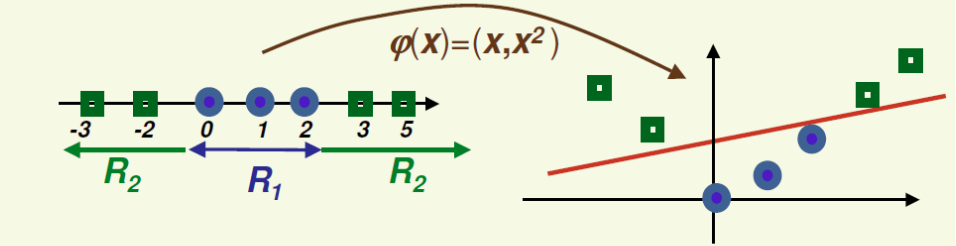
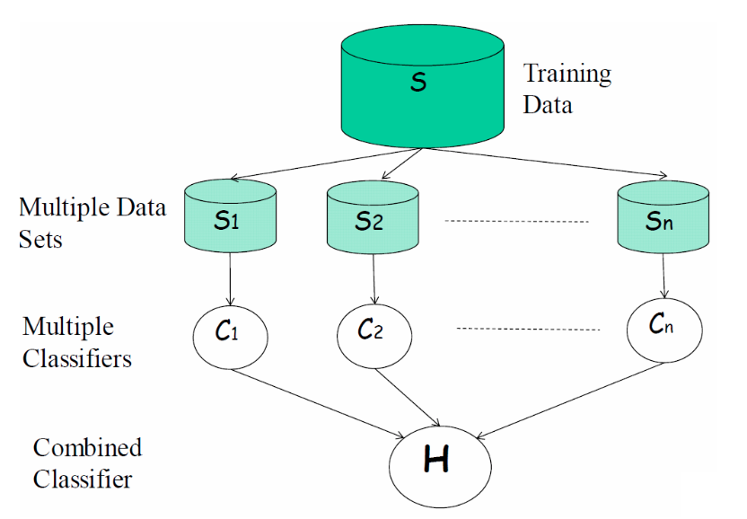
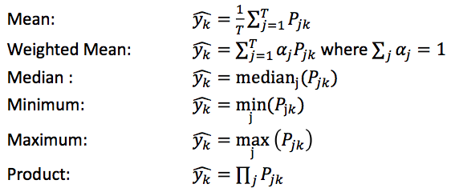

# CS 383 - Final Review

#### Time
Wednesday March 22<sup>nd</sup>,
08:00 ~ 10:00 a.m.
@Randel 327

#### Rules
1. Close book, **one piece of paper with note**.
2. No calculator. (compute by hand or leave in formula)
3. Provide a sheet with necessary rules of calculus.

---
## Things to think about

#### What are you trying to do?
1. Find underlying pattern
2. Predict value
3. Predict class
    - Do you need / want class probabilities?

#### What do you have?
1. How many instances / observations?
2. How many classes?
3. How many features?
4. Do you have labels?

#### Enough data
1. Enough data?
2. Do you need to do cross validation?

#### Features
1. Do you need / want to "normalize" them?
2. Do you need all of them?
3. How correlated are they?
4. Would you benefit from PCA, LDA or Greedy Selection?
5. Is the data linearly separable?
    - Do you need to work in a higher dimension (kernel)?

#### What do you want to maximize?
1. Likelihood
2. AUC
3. Precision & Recall
4. Accuracy

#### Initialize parameter
1. If necessary can you initialize parameter in an "intelligent" way?
    - Use large learning rate do a few steps, and than use that result as initialize parameter.
    - Some problem we family with, manually estimate initialize parameter.

---
## Course Algorithms
###### For each algorithm think about:
1. Supervised or un-supervised
2. Classification, Clustering, or Regression
3. Model based or instanced based algorithm
4. Linear vs Non-Linear
5. How to deal with categorical data
6. How to deal with continuous valued data
7. Training complexity (memory and computation)
8. Testing complexity (memory and computation)
9. How to deal with overfitting
0. How to use for multi-class classification

#### PCA
1. Un-supervised
2. Regression
3. Instanced based algorithm
4. Linear
5.
6.
7.
8.
9.
0.

#### LDA
1. Un-supervised
2. Regression
3. Instanced based algorithm
4. Linear
5.
6.
7.
8.
9.
0.

#### K-means Clustering

#### Agglomerative Clustering

#### Linear Regression

#### (Naive) Bayesian Inference

#### Decision Trees

#### K-Nearest Neighbors

#### Support Vector Machines

#### Logistic Regression

#### Artificial Neural Network

#### Ensemble learning

#### Markov Systems / Models

---
## Basic Ideas

#### Projection

- Projecting points onto a projection matrix
- PCA (Principal Component Analysis)
    - Choose the number of dimensions we want, k < D and project the original data onto the principal components.
- LDA (Linear Discriminant Analysis)
    - Find projection to a line such that samples from different classes are well separated

#### Information gain / entropy
1. entropy
    - Given probability of event v<sub>1</sub>, ..., v<sub>n</sub> as P(v<sub>1</sub>), ..., P(v<sub>n</sub>) we can compute entropy 
    - Entropy measure the randomness of the data
2. Information gain (IG)
    - 
    - Choose the attribute with the largest IG!

#### Feature types
1. Categorical
    - Examples: Car Model, School
2. Finite Discrete Valued
    - Ordering still matters, but there’s only so many values out there
3. Continuous Valued
    - Examples: Blood Pressure, Height

#### Standardization
- Standardized data has **Zero mean** and **Unit deviation**.
-  When do we standardizing data?
    - **Before we start using data** we typically want to standardize non-categorical features (this is sometimes referred to as normalizing them).
- How to standardizing data?
    1. Treat each feature independently
    2. Center it (subtract the mean from all samples)
    3. Make them all have the same span (divide by standard deviation)
- Why do we need to standardizing data?
    - If we used the data as-is, then one feature may have more influence than the other.

#### LSE (least squared estimate)

#### MLE (maximum likelihood estimate)

#### Overfitting / Underfitting
- Identifying (detect)
    - [under-fitting]
    Don’t do well on either the training or the testing set
    - [over-fitting]
    Do well on the training set but poorly on the testing set
- Solving
    - under-fitting
        - Make a more complex model (May involve need more features)
        - Trying a different algorithm
    - over-fitting
        - Use a less complex model (May involve using less features)
        - Try a different algorithm
        - Get more data
        - Use a third set to choose between hypothesis (called a validation set)
        - Add a penalization (or regularization) term to the equations to penalize model complexity

#### Dataset
1. Training set
    -  build/train system using the training data
2. Testing set
    - test system using the testing data
3. Validation set
    - for model selection

#### Bayes' Rule
- 
- In Bayes’ Rule we call
    - 𝑃(𝑦=𝑖|𝑓=𝑥) the posterior (what we want)
    - 𝑃(𝑦=𝑖) the prior (probability that 𝑦=𝑖)
    - 𝑃(𝑓=𝑥|𝑦=𝑖) the **likelihood** (likelihood of generating 𝑥 given 𝑦)
    - 𝑃(𝑓=𝑥) the evidence

#### Evaluation
1. RMSE
    - *root mean squared error*
    - 

2. Accuracy
    - 

3. Precision, Recall, F-Measure
    - Error Type
        - Example:
            FP = Negative Examples, Predicted Positive
        - True positive = Hit
        - True negative = Correct rejection
        - False positive = False Alarm (Type 1 error)
        - False negative = Miss (Type 2 error)
    - 
    - 
    - 

4. PR Graph, ROC Graph
    - PR Graph: Precision VS Recall
    - ROC Graph:TPR vs FPR
        - 
        - 

5. Area Under Curve (AUC)

6. Thresholding
    - Anything below that threshold is class 0, anything above it is class 1

#### Binary vs Multi-Class classification

---
## Decision Trees

#### Using

#### Building via ID3

---
## Kernels
- A function that takes two samples and returns a similarity is called kernel function, 

#### Mapping Functions
- Linear / Cosine: 
- Polynomial kernel: 
- Gaussian Radial Basis kernel (RBF): 
- Histogram intersection: 
- Hellinger kernel: 


#### Kernel Trick
- Sometimes we may want to go to a higher feature
space. Because we have a linear classifier and the data is not directly linearly separable.
- One solution would be to map our current space to another separable space. Then project data to **higher** dimension using mapping function .
- Using the polynomial kernel of degree two on observations with a single feature is equivalent to compute the cosine similarity on observations in 3D space.


---
## K-Nearest Neighbors
- Idea: Assign label to 𝑥 according to the label of the training example nearest 

---
## Support Vector Machines
- Maximize distance to closest example (of each type)

#### Intuition
- We want hyperplane as far as possible from any sample
- New samples close to old samples will then be classified correctly
- Our goal is to maximize the margin
    - The margin is twice the absolute value of distance b of
the closest example to the hyperplane

---
## Logistic Regression
- Logistic Regression is not regression. It’s **classification**!
- sigmoid or logistic function .
    - 
    - 

#### Model form and how to use
logistic function 用一遍

#### Maximum Log Likelihood Estimate approach (MLE)
- 
- Ideally we’d like to take the derivative of this with respect to 𝜃, set it equal to zero, and solve for 𝜃 to find the maxima
    - The closed form approach
    - But this isn’t easy
- So what’s our other approach
    - Do partial derivatives on the parameters and use gradient descent! (actually in this case gradient ascent, since we’re trying to maximize)

#### Gradient Ascent derivation
- 
- We want this to go towards zero (local maxima)
- So, update 𝜃<sub>j</sub> as
    - 
    - 

---
## Artificial Neural Networks

#### Computing Forward Propagation
```
hidden = 1 ./ ( 1 + exp(-1 .* data * beta) );
output = 1 ./ ( 1 + exp(-1 .* hidden * theta) );
```

#### Performing Backwards Propagation
```
delta_out = correctValue - output;
theta = theta + (eta/N) .* (hidden' * delta_out);
delta_hid = (delta_out * theta') .* hidden .* (1 - hidden);
beta = beta + (eta/N) .* (data' * delta_hid);
```

#### Derivation of back propagation rules

---
## Deep Learning
- Same idea as regular ANNs but with additional hidden layers.

#### Multi-Layer Intuition
- Output layer – Here predicting a supervised target
- Hidden layers – These learn more abstract representations as you head up
- Input layer – Raw sensory inputs (roughly)

#### Issues with multi-layers
- First layer learns 1st order features (e.g. edges, etc..)
- 2<sup>nd</sup> layer learns high order features (combinations of first layer features, combination of edges, etc..)
- Then final layer features are fed into supervised layer(s)

#### Auto-Encoders
- Attempts to find a hidden layer that can reproduce the input
- Basic process to get a hidden layer from one auto-encoder is:
    1. Take the input, add some noise to it, and add a bias node
    2. Choose the hidden layer size to be less than the input size
    3. The output layer should be the same size as the input (minus the bias node)
    4. Train this auto-encoder using the uncorrupted data as the desired output values.
    5. After training, remove the output layer (and its weights). Now you have your hidden layer to act as the input to the next layer!
- Stacked auto-encoders
    - Do supervised training on last layer
    - Then do supervised training on whole network to fine tune the weights

---
## Ensemble Learning
Basic idea: Build different “experts” and let them collaborate to come up with a final decision.



#### Intuition
- Advantages:
    - Improve predictive performance
    - Different types of classifiers can be directly included
    - Easy to implement
    - Not too much parameter tuning (other than that of the individual classifiers themselves)
- Disadvantages
    - Not compact
    - Combine classifier not intuitive to interpret

#### Voting
- Classification: Given unseen sample x
    - Each classifier c<sub>j</sub> returns the probability that x belongs to class i =1, ...C as P<sub>ji</sub>(x)
        - Or if they can't return probabilities, they will return P<sub>ji</sub>(x)∈{0,1}
    - Decide how to combine these "votes" to get a value (probability) for each class y<sub>i</sub>, and make final decision.

- How to combine the opinions of classifiers


#### Bagging

#### Boosting (Adaboost algorithm)


---
## Random Forests

#### Intuition

#### Building
