## What is Machine Learning?

#### Definition:
- The study of computer algorithms that improve automatically through experience

#### Formally:
- Improve at task T
- With respect to performance measure P
- Based on experience E

---
## Type of Problems in ML
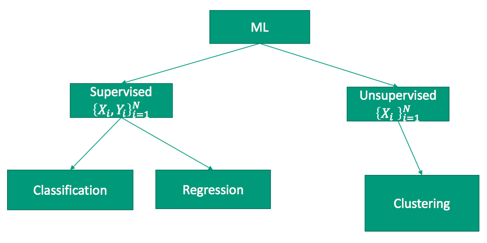

#### Clustering
- Given some data we want to figure out how to group them
together.

#### Regression
- Given some data, we want to predict an outcome value.

#### Classification
- Given data, can we predict which category something
belongs to.

---
## Types of Algorithms in ML

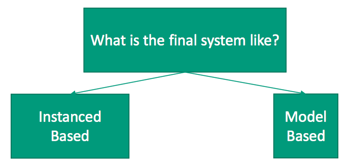

#### Instance Based Algorithms
- After training, performing the desired task (classification, regression, clustering, etc..) is based on training data samples themselves

#### Model Based Algorithms
- Training involves learning a model such that performing the desired task is done by running the data through model (which does not directly reference training data samples)

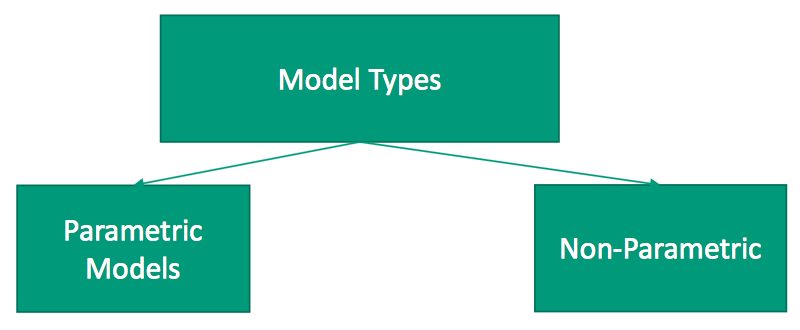

#### Parametric Algorithms
- The model we’re learning is based on blending information via parameters. These parameters must be learned during the training process.

#### Non-Parametric Algorithms
- These algorithms/models are not defined by determining blending
parameters.
- However there still may be use-specified parameters

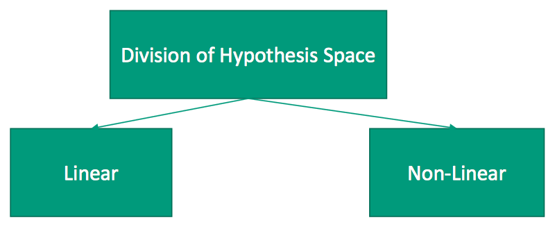

A large part of machine learning is attempting to divide the hypothesis space, like separate it into clusters and separate it into classes.These “dividers” can be either Linear or Non-Linear.
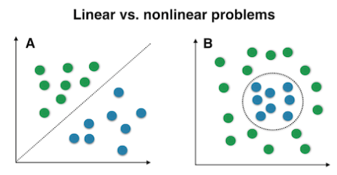

---
## Types of Data in ML

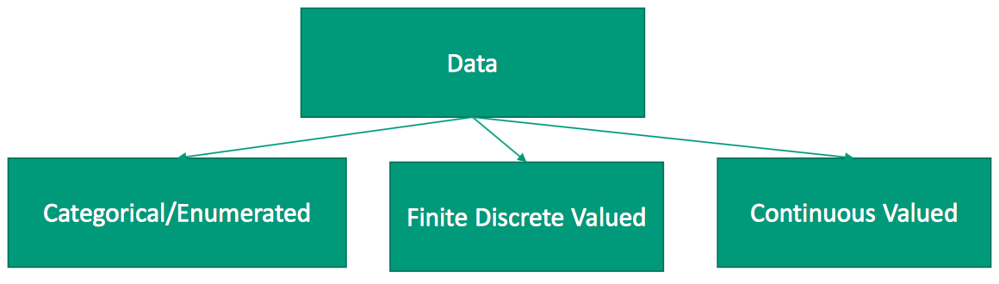

#### Categorical
- Examples: Car Model, School

#### Finite Discrete Valued
- Ordering still matters, but there’s only so many values out there

#### Continuous Valued
- Examples: Blood Pressure, Height

---
## No Free Lunch Theorem
- Unfortunately there’s no single machine learning algorithm to rule them all
- Typically we must consider the previous information in deciding which set of algorithms to train and test and then we select the best.

---
## Standardizing Data
- Standardized data has **Zero mean** and **Unit deviation**.

#### When do we standardizing data?
- **Before we start using data** we typically want to standardize non-categorical features (this is sometimes referred to as normalizing them).

#### How to standardizing data?
1. Treat each feature independently
2. Center it (subtract the mean from all samples)
3. Make them all have the same span (divide by standard deviation)

#### Why do we need to standardizing data?
- If we used the data as-is, then one feature may have more influence than the other.

---
## Data Dimensionality

#### Definition

If data sample Xi has D values associated with it (which we call features) then we can write this as  and call D the dimensionality of Xi.

#### Drawbacks of too much information
1. Computation Cost
    - Both time and space efficiency
2. Statistical Cost
    - Too specific? Doesn’t generalize enough?
    - Too susceptible to noise?
3. Visualization
    - How can we look at the data to understand its structure?

#### Curse of Dimensionality
- In higher dimension space we need exponentially more
samples for equivalent coverage.
- Therefore if our data is in high dimensional space it will likely sparsely cover that space and instances will be far apart from one another

---
## Dimensionality Reduction

#### Goal
- Represent instances with fewer variables
- Try to preserve as much structure in the data as possible
- If there is class information, increase class separability (Discriminative)

#### Benefits
- Need less data to cover the feature space
- Easier learning – fewer parameters to learn
- Easier visualization – hard to visualize more than 3D or 4D

#### Approaches
- Feature selection
    - Pick a subset of the original dimensions
    - If there is class information, pick good class predictors (Discriminative)
- Feature construction
    - Construct a new set of features from existing
    - In particular we’ll look at feature projection

---
## Feature Selection
- Give set of features, some features are more important than others. We want to select some subset of features to be used by learning algorithms.
- Score each feature then Select set of features with best score

#### Entropy
- Given probability of event v1, ..., vn as P(v1), ..., P(vn) we can compute entropy

- Entropy measure the randomness of the data

#### Reminder with respect A
- Let p = #{1}, be the number of samples with label one over the entire dataset.
- Let n = #{0}, be the number of samples with label zero over the entire dataset.
- Let pi, ni, be the number samples in subset Ei.
- Define reminder with respect A with

#### Information Gain (IG) / reduction in entropy
- 
- We should choose the attribute with the largest IG!

#### IG Example

###### For reference
- 
- 
- 

###### Samples
- Class 1: {(1,1),(1,3),(2,2)}
- Class 2: {(1,2),(3,2),(2,2)}

###### Feature 1
- Data:
    - p1=2, n1=1
    - p2=1, n2=1
    - p3=0, n3=1
- Reminder
    - 
    - 
- IG
    - 

###### Feature 2
- Data:
    - p1=1, n1=0
    - p2=1, n2=3
    - p3=1, n3=0
- Reminder
    - 
    - 
- IG
    - 

---
## Feature projection
- Projecting points onto a projection matrix

## PCA (Principal Component Analysis)

#### Intuition
- Defines a set of principal components (basis)
    - 1st: direction of the greatest variability in the data
    - 2nd: perpendicular to 1st, greatest variability of what's left
    - Etc... until D, the original dimensionality
- Choose the number of dimensions we want, k < D and project the original data onto the principal components.
- Each projection will result in a point on that axis, resulting in an new k-dimensional feature vector.
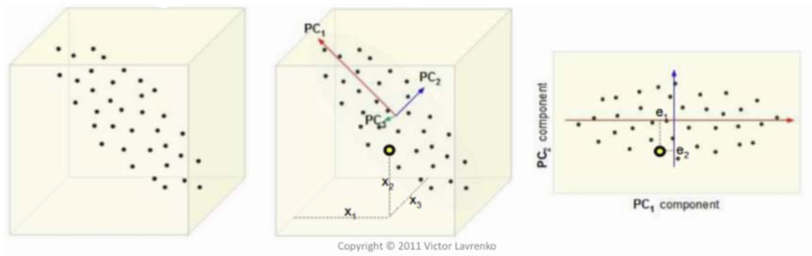

#### Mechanics
- Standardize data
    - Compute the mean
    - Compute the Standard deviation
    - data = (data - mean) / std
- Find covariance matrix
    - N = Number of observations
    - cov = dataT data / (N-1)
- Find eigenvalues
- Find eigenvector for the largest eigenvalue
    - value = largest eigenvalue
    - vector = the eigenvector for given eigenvalue
    - find vector, where (cov - value) * vector = 0
- Project the data
    - data * vector

## LDA (Linear Discriminant Analysis)

#### Intuition
- Main idea: find projection to a line such that samples from
different classes are well separated
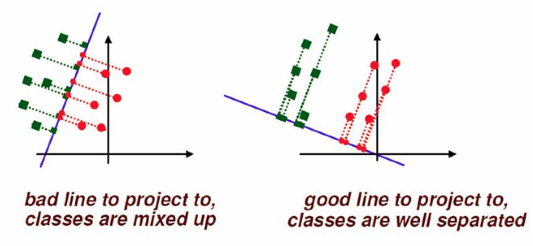

#### Mechanics
- Standardize data for each class
- Compute the mean for each class
- Compute scatter matrices for each class
    - cov(C) = CT C / (N-1)
    - 𝜎2 = (N-1) * cov(C)
- Within class scatter matrix
    - SW = 𝜎12 + 𝜎22
    - SW-1 = inverse of SW
- Preform eigen-decomposition
    - 𝑆B = (𝜇1-𝜇2)T(𝜇1-𝜇2)
    - Compute SW-1SB
- Find eigenvalues
- Find eigenvector for the only none-zero eigenvalue
    - W, the eigenvector will be used to project data.
- Project the data
    - class1 * W
    - class2 * W

---
## Clustering

#### Definition
- The process of grouping a set of objects into classes of similar objects
    - Items within cluster should be similar
    - Observations from different clusters should be dissimilar
- Clustering is the most common form of unsupervised learning
- Hard vs Soft Clustering
    - Hard clustering: Each observation belongs to exactly one cluster
    - Soft clustering: An observation can belong to more than one cluster

## K-Means

#### Intuition
- Assumes observations are real-valued vectors
- Each observation is associated with a single reference vector
- The initial reference vectors are often chosen at random
- At each iteration
    - Each observation is reassignment to the reference vector closest to it
    - A new reference vector is computed based on the observations that are associated with it
- This continues until some termination criteria is met
    - Number of iterations
    - Threshold on change of reference vectors.

#### Prove (intra-cluster LSE)
TODO: Converges -> intra-cluster LSE won't change.

## Expectation Maximization

#### Intuition
- These types of algorithms try to find a solution by alternating between two steps:
    1. Expectation – Here’s we predict out outcome.
        - For k-means, this is assigning each instance to a cluster.
    2. Maximization – Here we update our model to
maximize/minimize something.
        - For k-means this is moving the reference vector to the mean of the cluster in order to minimize the distance.
        - Conversely we sometimes maximize the log-likelihood

#### Gaussian Mixture Models
1. Start with two random starting vectors μ1 and  μ2 and compute sample standard deviations σ1 and σ2 to initialize Gaussians N1(μ1, σ1) and N2(μ2, σ2)
2. Initialize probabilities of each Gaussian. We will need this for the E-Step computations. Typically this will be done uniformly unless there is prior information:  where k is the number of Gaussians.
3. [E-Step] For each observation compute the likelihood (expectation) of each Gaussian given the observation.
    - That is compute  and 
4. [M-Step] Adjust N1(μ1, σ1) and N2(μ2, σ2), P(N1) and P(N2) to better fit the estimates (maximize the likelihood).
5. Iterate (repeat 3-4) until convergence.

## Hierarchical Clustering

#### Building cluster tree
- With hierarchical agglomerative clustering we’re building a clustering *binary* tree
- At each iteration we have a new set of clusters
- [Top-down Approach]
    - At first everything is part of a single cluster.
    - Then split this into two clusters based on some criterial
    - Now choose one of these two clusters, and split it into two
    - Etc.. until each cluster only has one observation in it (called a singleton)
- [Bottom-Up Approach]
    - At first everything is its own cluster.
    - Choose two of these clusters to merge.
    - From these N − 1 clusters, choose two to merge.
    - Etc.. until there is only one cluster.

#### Intra vs inter cluster distance
- Intra-Cluster Distance
    - Distances between nodes in the same cluster
- Inter-Cluster Distance
    - Distances between nodes between clusters

#### Link Types
- Single link
    - Similarity of the most similar
    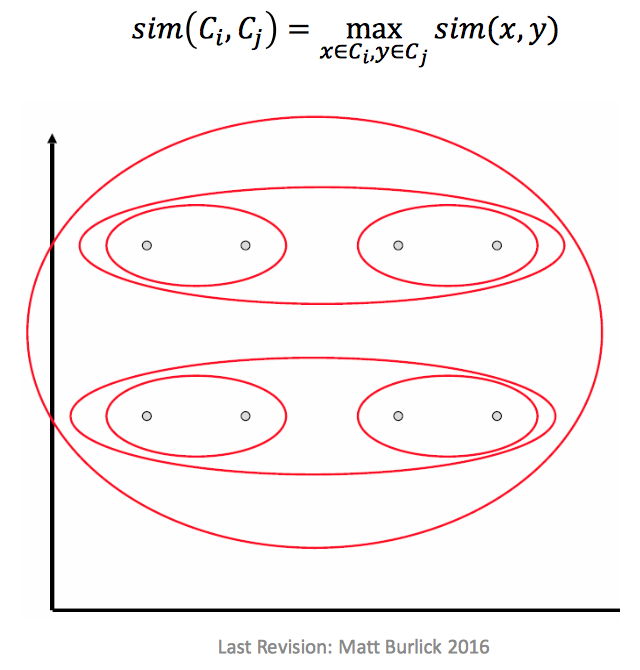
- Complete link
    - Similarity of the furthest points
    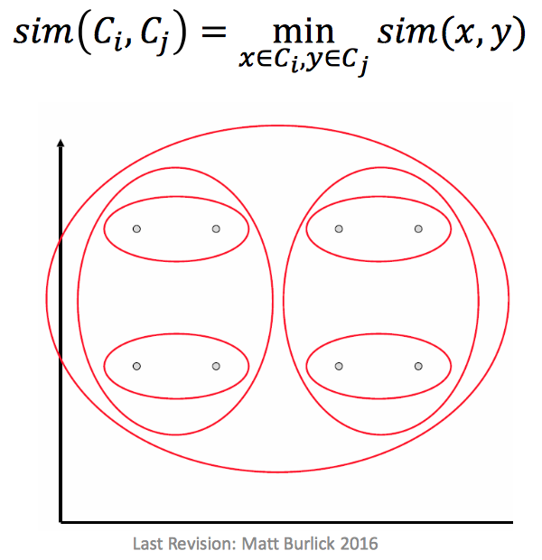
- Average link
    - Average pair-wise similarity between clusters
    - 

#### Purity
- Let Nij be the number of instances of (supervised) label j within cluster Ci
- 
- Define the average purity of this clustering as 

---
## Supervised learning

#### Data sets
- Training set
    -  build/train system using the training data
- Testing set
    - test system using the testing data
- Validation set
    - for model selection

#### Cross Validation
- How to do cross validation
    - [S-Folds] Here we’ll divide our data up into 𝑆 parts, train on 𝑆 − 1 of them and test the remaining part. Do this 𝑆 times.
    - [Leave-one-out] If our data set is really small we may want to built our system on 𝑁 − 1 samples and test on just one sample. And do this 𝑁 times (so it’s basically N-folds)
- Why cross validation
    - Do not have that much data.

#### Over / under fitting
- Identifying (detect)
    - [under-fitting]
    If we don’t do well on either the training or the testing set
    - [over-fitting]
    If we do well on the training set but poorly on the testing set
- Solving
    - under-fitting
        - Make a more complex model (May involve need more features)
        - Trying a different algorithm
    - over-fitting
        - Use a less complex model (May involve using less features)
        - Try a different algorithm
        - Get more data
        - Use a third set to choose between hypothesis (called a validation set)
        - Add a penalization (or regularization) term to the equations to penalize model complexity

#### Bias / variance
- If our trained model is very dependent on the training data set (that is it fits it very well), then there will be a large **variance** in the models given different training sets.
- If our model barely changes at all when it sees different training data, then we say it is **biased**.
- Relation
    - variance and overfitting are related
    - bias and underfitting are related

## Linear Regression

## Classification

#### Error Types
|                 |Predicted Positive|Predicted Negative|
|:---------------:|:----------------:|:----------------:|
|Positive Examples|  True  Positive  |  False Negative  |
|Negative Examples|  False Positive  |  True  Negative  |
- True positive = Hit
- True negative = Correct rejection
- False positive = False Alarm (Type 1 error)
- False negative = Miss (Type 2 error)

#### Binary evaluation metrics
-  measure to evaluate the quality of a classifier
    - 
    - 
    - 
- Precision-Recall graph
    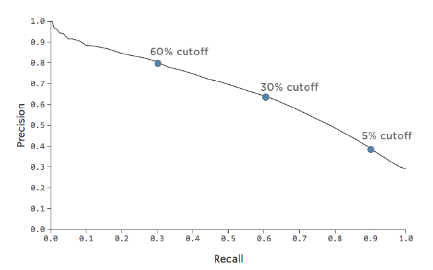
- Impact on varying Threshold
    - Plotting precision and recall as a function of the threshold creates something called a precision-recall curve (PR)

#### Accuracy metric
- 
- True positive rate 
- False positive rate 

 ---
 bias -> model not change
 variance -> model change to quick

 LR - regularization term
 J𝜃 = 𝑌−𝑋𝜃2+𝜆𝜃𝑇𝜃
 𝜆 from 0 ~ 1.  𝜆 larger -> bias
